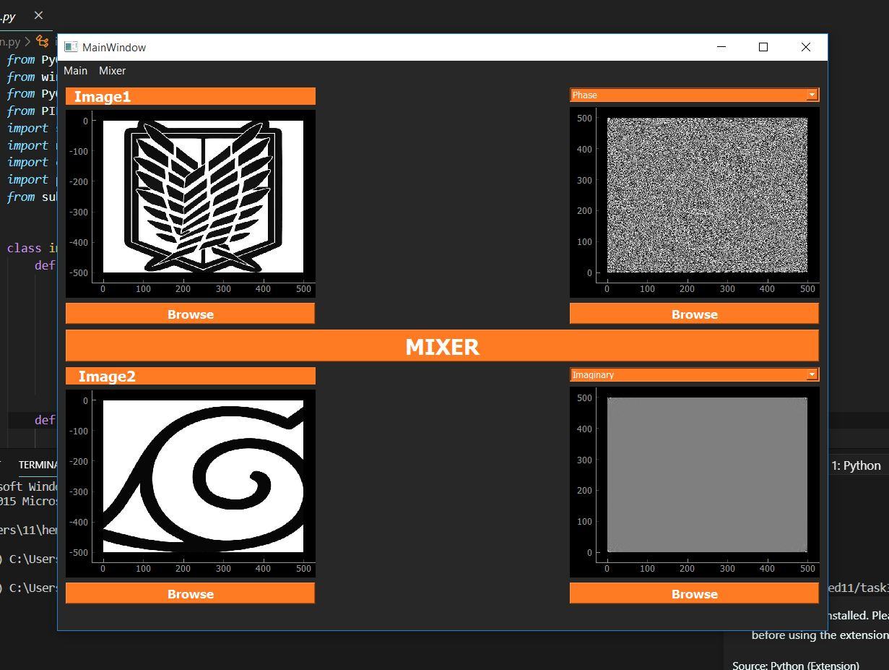
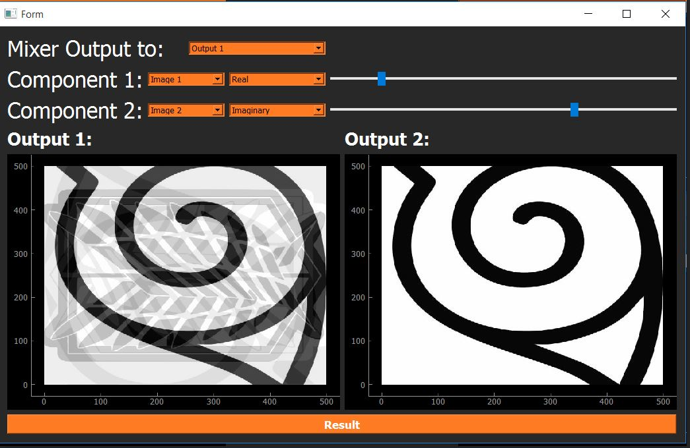
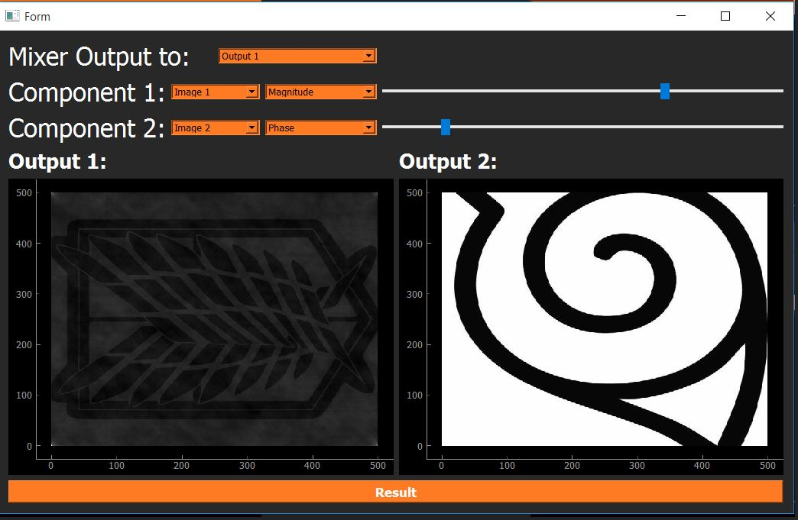
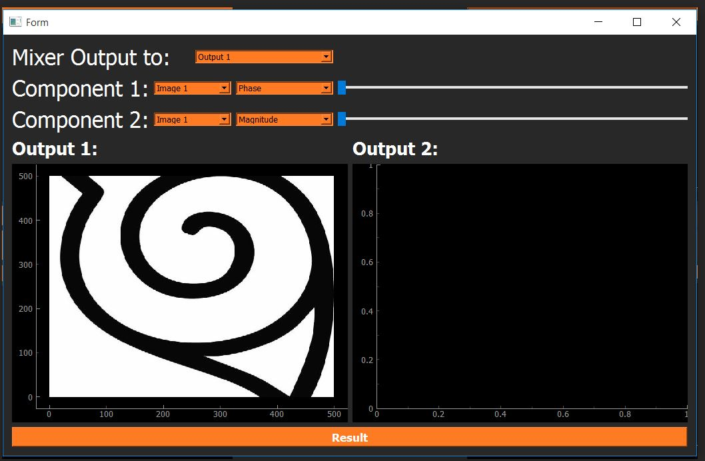
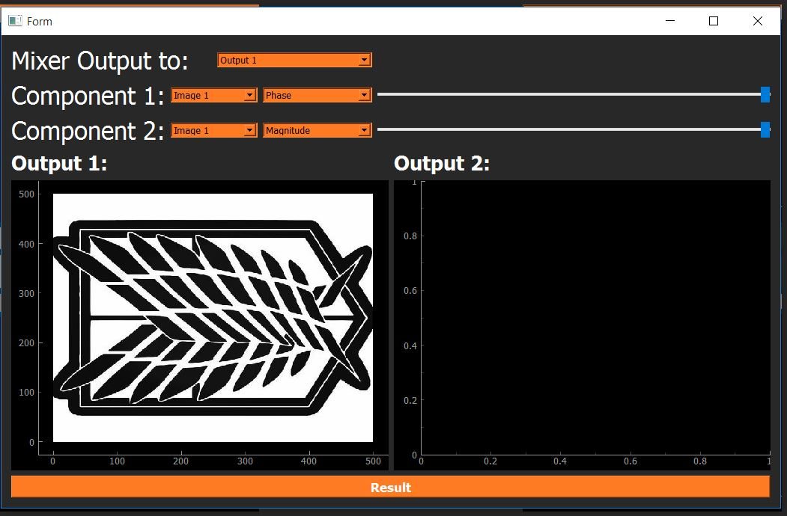

# Image-Processing-App

## **Author**

Mohamed Ahmed Abd El-Monem

---

## To Run the application

python main.py

---

## How To Use This Application

## First tab:

1. You ca browse an image and show its Magnitude, Phase, Real and Imaginary
2. You Mix two browsed Photos and it will turn you to Second tab

## Here is first tab

| Tab 1 |  
:-------------------------------------------------------------:
| 

## Second tab:

1. You Can mix two browsed photos [ (Magnitude, Phase) or (Phase, Magnitude) ].
2. You Can mix two browsed photos [ (Real, Imaginary) or (Imaginary, Phase) ].
3. You can choose percentage of each image by Sliders.

## Here is Second tab

| Tab 2 |  
:-------------------------------------------------------------:
| 

## Here is some examples for mixing images

|   Mixing two images with different percentages   |          Mixing two images with different percentages           |
| :----------------------------------------------: | :-------------------------------------------------------------: |
|  |  |

|    Mixing two images both of them are 0 percentage    |                     Mixing two images both of them are 100 percentage                      |
| :---------------------------------------------------: | :----------------------------------------------------------------------------------------: |
|  |  |
